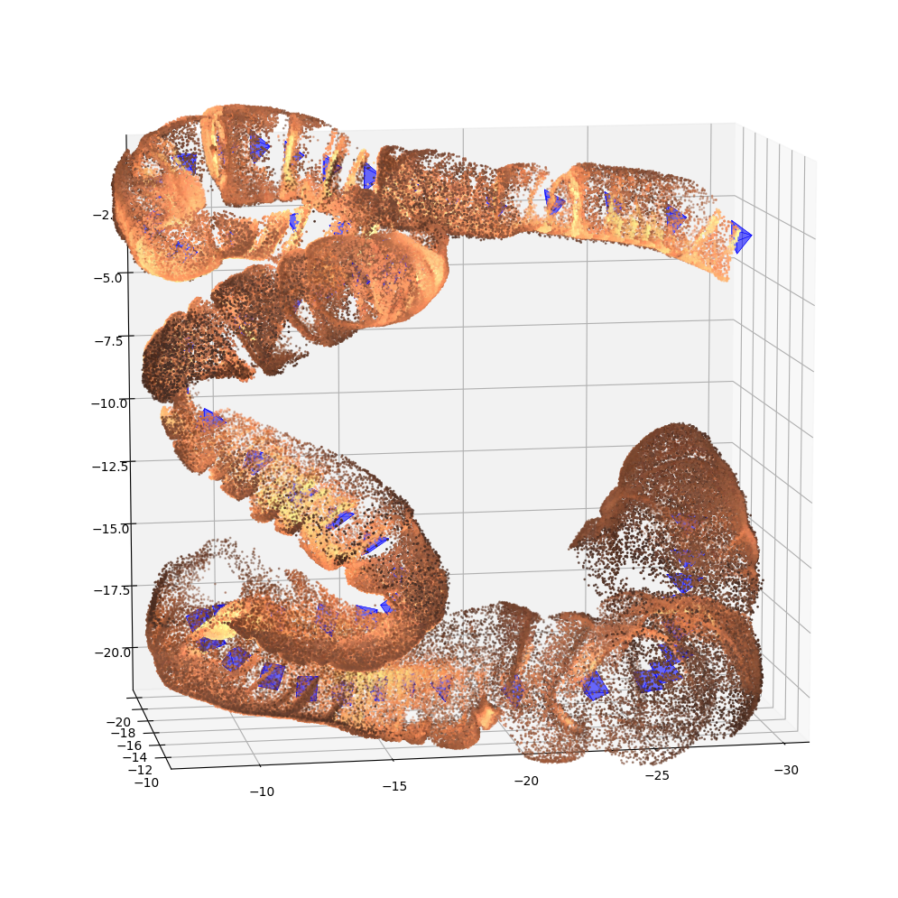

# [Bimodal Camera Pose Prediction for Endoscopy](https://arxiv.org/abs/2204.04968)

The data from our paper and sequences from additional anatomies can be accessed for the SimCol-to-3D MICCAI 2022 challenge.

<p align="center">
  
</p>

## ⚙ Getting started

The full dataset is now publicly available [here](https://rdr.ucl.ac.uk/articles/dataset/Simcol3D_-_3D_Reconstruction_during_Colonoscopy_Challenge_Dataset/24077763). Access through Synapse is no longer required. To visualize the data like above run `visualize_3D_data.py` with the updated path to the data. 

## 🌍 Submitting to the SimCol-to-3D MICCAI challenge

The SimCol Challenge is now closed. The results can be found in the challenge paper [here](https://arxiv.org/pdf/2307.11261.pdf). 

## 📊 Evaluation and challenge leader board

Tasks 1, 2, and 3 will be evaluated according to the scripts in `evaluation`. To evaluate your method on validation data, generate predictions according to the `docker_templates` and run
```
python evaluation/eval_synthetic_depth.py /path/to/predictions /path/to/groundtruth
```
